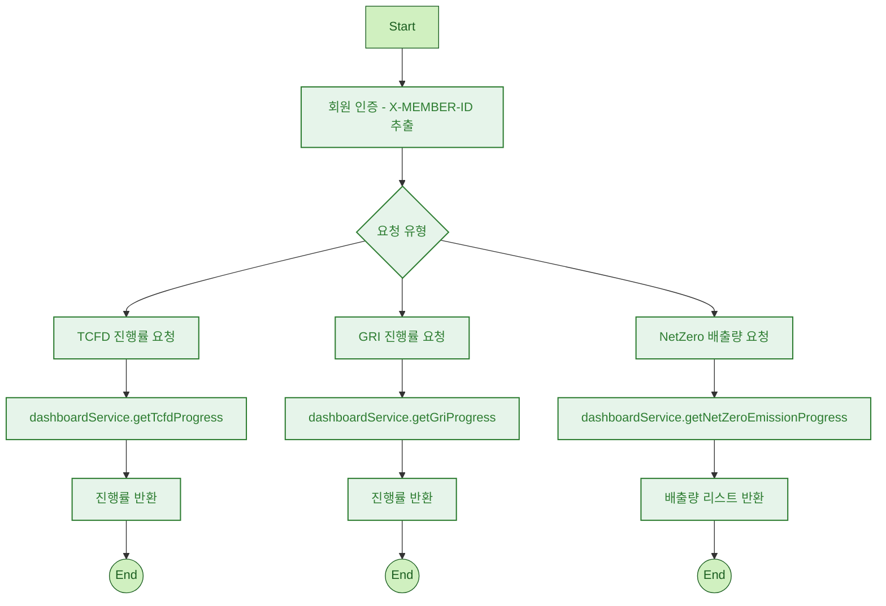

```mermaid
flowchart TD
    A[Start] --> B[회원 인증 - X-MEMBER-ID 추출]

    %% 요청 유형 분기
    B --> C{요청 유형}

    %% TCFD 진행률
    C --> D1[TCFD 진행률 요청]
    D1 --> E1[dashboardService.getTcfdProgress]
    E1 --> F1[진행률 반환]
    F1 --> Z1((End))

    %% GRI 진행률
    C --> D2[GRI 진행률 요청]
    D2 --> E2[dashboardService.getGriProgress]
    E2 --> F2[진행률 반환]
    F2 --> Z2((End))

    %% NetZero 배출량
    C --> D3[NetZero 배출량 요청]
    D3 --> E3[dashboardService.getNetZeroEmissionProgress]
    E3 --> F3[배출량 리스트 반환]
    F3 --> Z3((End))

    %% 색상 스타일 정의
    classDef forest fill:#e6f4ea,stroke:#2e7d32,stroke-width:1.5px,color:#2e7d32;
    classDef terminal fill:#d0f0c0,stroke:#1b5e20,color:#1b5e20;

    %% 클래스 적용
    class A,Z1,Z2,Z3 terminal;
    class B,C,D1,D2,D3,E1,E2,E3,F1,F2,F3 forest;
```
