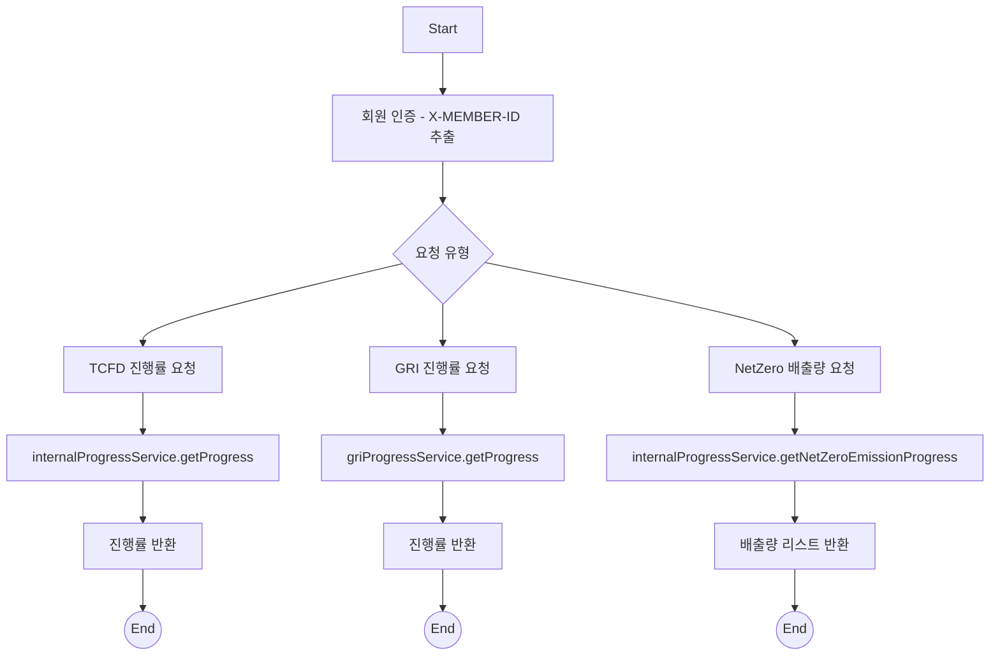

```mermaid
flowchart TD
A[Start] --> B[회원 인증 - X-MEMBER-ID 추출]

%% 요청 유형 분기
B --> C{요청 유형}

%% TCFD 진행률
C --> D1[TCFD 진행률 요청]
D1 --> E1[internalProgressService.getProgress]
E1 --> F1[진행률 반환]
F1 --> Z1((End))

%% GRI 진행률
C --> D2[GRI 진행률 요청]
D2 --> E2[griProgressService.getProgress]
E2 --> F2[진행률 반환]
F2 --> Z2((End))

%% NetZero 배출량
C --> D3[NetZero 배출량 요청]
D3 --> E3[internalProgressService.getNetZeroEmissionProgress]
E3 --> F3[배출량 리스트 반환]
F3 --> Z3((End))
```
