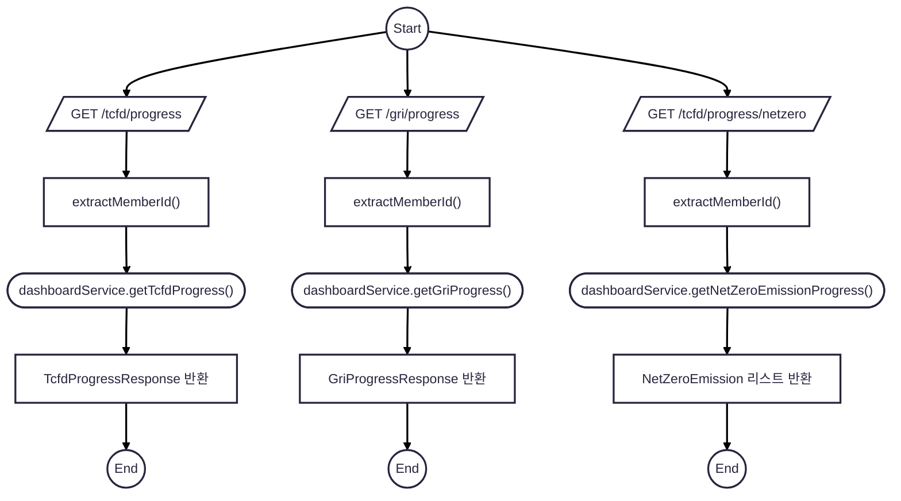

```mermaid
---
config:
      theme: redux
---
flowchart TD
start((Start))

%% TCFD 진행률 조회
start --> TCFD[/GET /tcfd/progress/]
TCFD --> TCFD_MID["extractMemberId()"]
TCFD_MID --> TCFD_Svc(["dashboardService.getTcfdProgress()"])
TCFD_Svc --> TCFD_Resp["TcfdProgressResponse 반환"]
TCFD_Resp --> end1((End))

%% GRI 진행률 조회
start --> GRI[/GET /gri/progress/]
GRI --> GRI_MID["extractMemberId()"]
GRI_MID --> GRI_Svc(["dashboardService.getGriProgress()"])
GRI_Svc --> GRI_Resp["GriProgressResponse 반환"]
GRI_Resp --> end2((End))

%% NetZero 배출량 진행률 조회
start --> NetZero[/GET /tcfd/progress/netzero/]
NetZero --> NZ_MID["extractMemberId()"]
NZ_MID --> NZ_Svc(["dashboardService.getNetZeroEmissionProgress()"])
NZ_Svc --> NZ_Resp["NetZeroEmission 리스트 반환"]
NZ_Resp --> end3((End))
```

